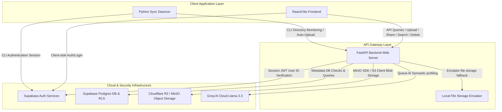
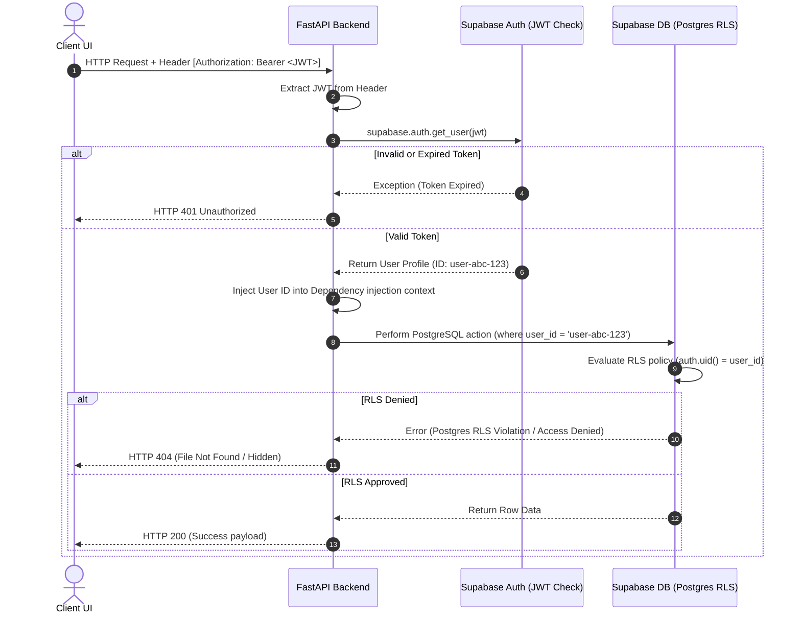
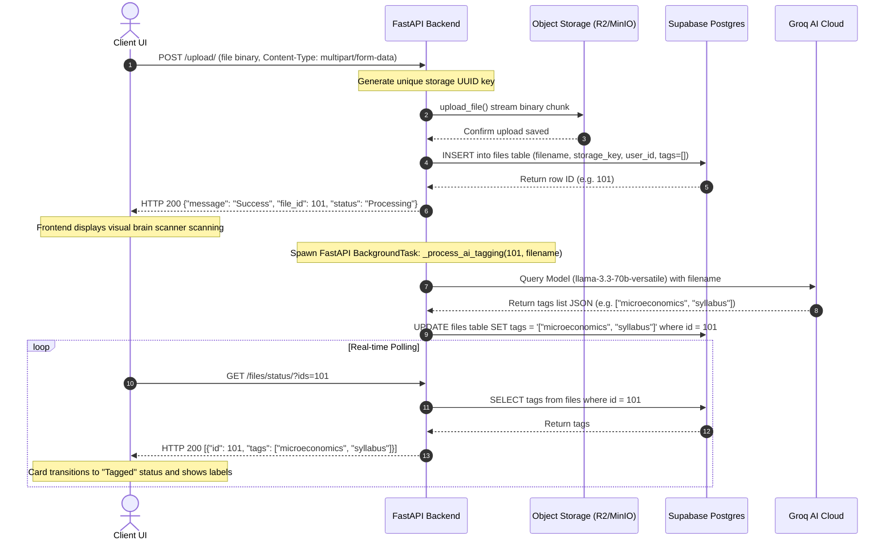
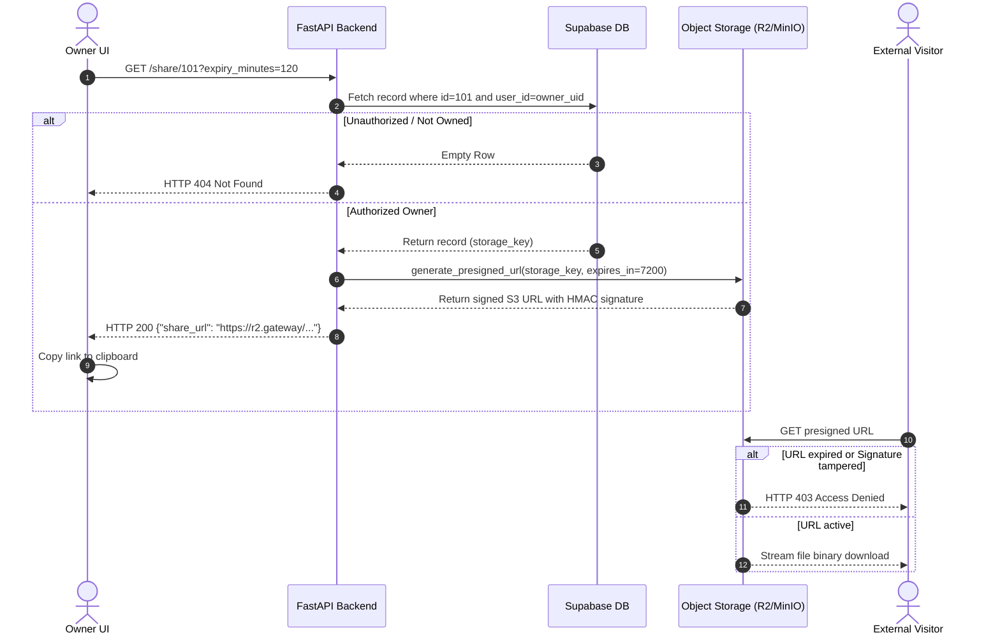

# Architecture & Design Document: BlackHole Cloud Storage Engine 🌌

This document provides a comprehensive technical overview of the architecture, design patterns, and system interactions within the **BlackHole** (formerly OrbitSync) platform.

---

## 1. System Overview

BlackHole is an intelligent, zero-friction, cloud-native file storage system that auto-profiles uploaded content using Large Language Models (LLMs) and secures metadata at the database layer using Row-Level Security (RLS) policies.



---

## 2. Component Design & Responsibilities

### 2.1 React/Vite Client
* **Role**: Single Page Application (SPA) serving as the user dashboard interface.
* **Technology**: TypeScript, React, Vite, Framer Motion (visual micro-animations), Tailwind CSS (styling), Lucide React (icons), and TanStack Query (caching state management).
* **Responsibilities**:
  * User authentication (sign-up, login, logout, and session persistence).
  * Direct binary upload tracking with interactive progress bars (XHR).
  * Direct retrieval of direct S3 presigned URLs for secure downloading.
  * Real-time polling status visualization for AI background profiling.
  * Accessibility (focus traps on modal Dialog overlays, keybindings, and semantic HTML structure).

### 2.2 Python watchdog Sync Daemon
* **Role**: Zero-friction background observer executing in the user's local operating system.
* **Technology**: Python, watchdog, requests, and Supabase client library.
* **Responsibilities**:
  * Watches a configured local directory (`~/BlackHole_Sync`) for file additions.
  * Automatically signs in to Supabase Auth using locally configured credentials.
  * Performs chunked multipart uploads to the FastAPI server, carrying the active JWT Bearer token in the `Authorization` header.

### 2.3 FastAPI Application Server
* **Role**: High-performance backend gateway mediating between storage, AI profiling, and database ledgers.
* **Technology**: Python, FastAPI, Uvicorn, Pydantic, and Boto3 (AWS SDK).
* **Responsibilities**:
  * JWT verification and user isolation enforcing.
  * Multi-provider storage client mapping (Local, MinIO, or S3/Cloudflare R2).
  * Asynchronous background worker spawning for AI profiling via the Groq SDK.
  * Database transaction mediation with the Supabase PostgREST Client.

### 2.4 Supabase Auth & Postgres Database
* **Role**: Identity provider and transactional relational database ledger.
* **Technology**: Supabase Auth (GoTrue API) and PostgreSQL.
* **Responsibilities**:
  * Enforces Row-Level Security (RLS) on metadata tables.
  * Restricts select, insert, update, and delete actions directly to the owner whose `user_id` matches `auth.uid()`.
  * Persists file records containing `id` (primary key), `filename`, `storage_key` (UUID mapping), `tags` (JSON text array), and `created_at`.

### 2.5 Object Storage Services
* **Role**: Object store hosting binary assets.
* **Technology**: Cloudflare R2 (S3-compatible API), MinIO (local storage emulator), or Local File System provider.
* **Responsibilities**:
  * Stores binaries under random UUID keys to prevent file path discovery attacks.
  * Serves short-lived presigned URLs for secure downloading and sharing.

---

## 3. Core Pipelines and Flows

### 3.1 Authentication & Request Lifecycle Flow
Each protected request carries a JWT header. The FastAPI server validates this against Supabase Auth:



---

### 3.2 Multipart Upload & AI Auto-Profiling Pipeline
To provide zero-friction organization, file uploads immediately return success, leaving heavy AI tagging to background worker threads:



---

### 3.3 Secure Expiring Sharing Flow
BlackHole generates secure, expiring URL links. Storage blobs are never exposed directly:



---

## 4. Architectural Patterns & Clean Code Design

### 4.1 Repository/Provider Pattern for Storage
The system abstracts the storage provider through a base interface (`StorageProvider`), allowing the platform to shift backends seamlessly without changing route handlers:

```
[FastAPI Router (app/api.py)]
            │
            ▼ depends on
   [StorageProvider (app/core/storage/base.py)]
            │
            ├─► LocalProvider (app/core/storage/local_provider.py) ──► Local Disk Emulator
            ├─► MinIOProvider (app/core/storage/minio_provider.py) ──► Local Container S3
            └─► S3Provider (app/core/storage/s3_provider.py)      ──► Production Cloudflare R2 / AWS S3
```

### 4.2 Lazy Connection Proxy
To avoid startup validation delays (which cause Render deployments to time out during health checks), external dependencies like Supabase client are wrapped in a proxy client pattern:
* Initial app start runs instantly and registers a `/health` endpoint.
* When the first transactional endpoint `/files/` is requested, the client initialization is triggered, validating environment credentials lazily.
