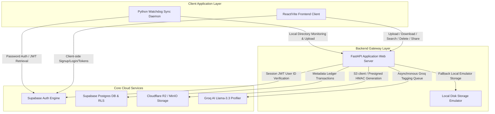
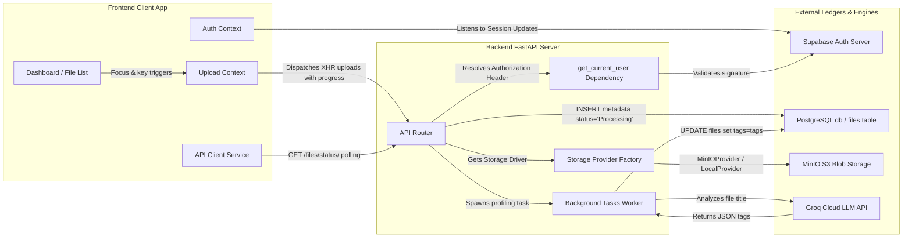
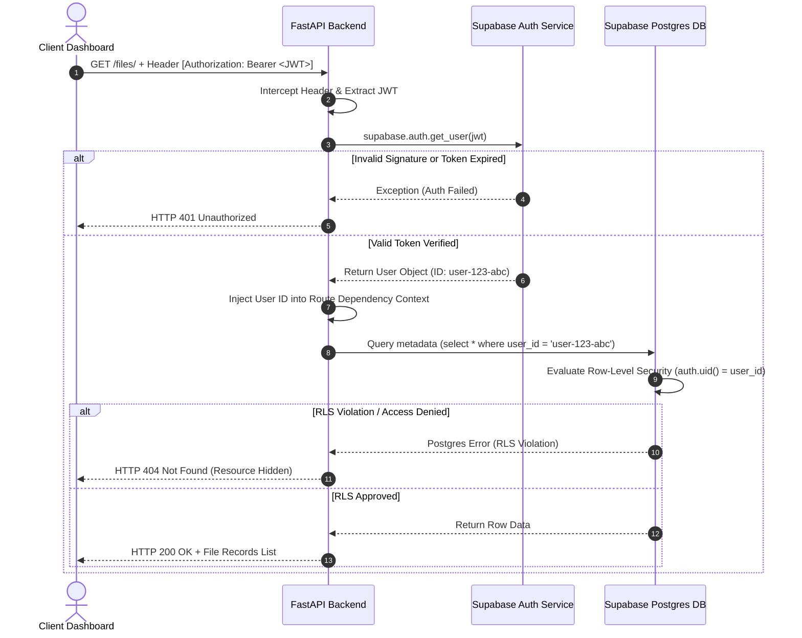
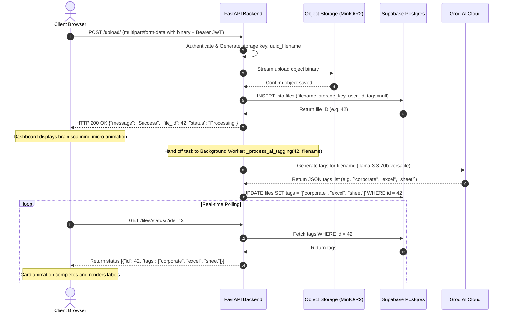
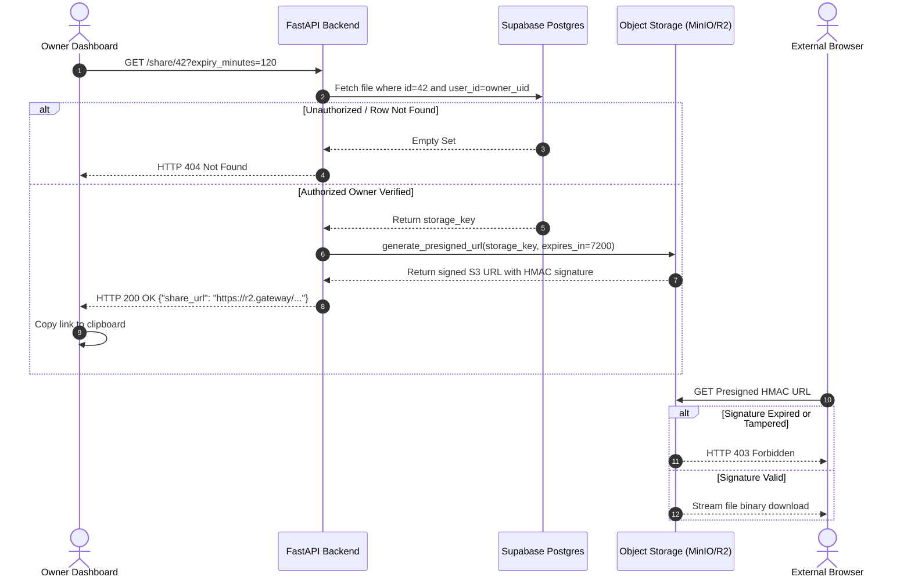
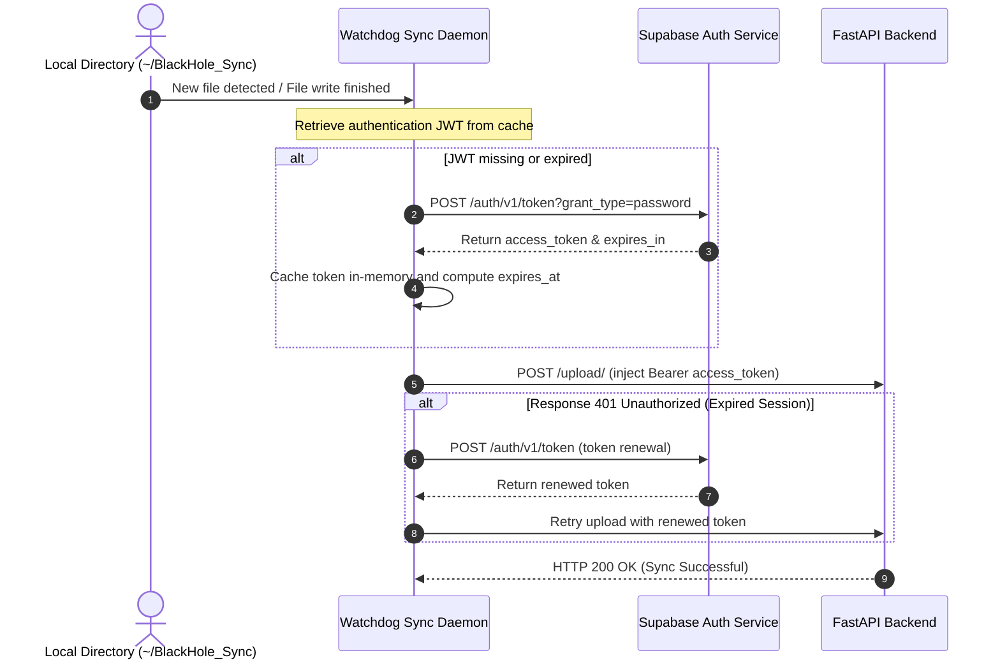

# BlackHole 🌌
### Autonomous AI-Powered Cloud Storage Engine

[](LICENSE)
[](https://www.python.org/)
[](https://nodejs.org/)
[](https://orbit-sync-backend.vercel.app)
[](https://orbitsync-backend.onrender.com)

BlackHole (formerly OrbitSync Vault) is a cloud-native, high-performance intelligent object storage platform designed for zero-friction file organization, semantic search indexing, and real-time background synchronization. Built with a robust, asynchronous **FastAPI** backend, **Groq Cloud AI (Llama 3.3)** semantic profiler, **Supabase** metadata ledger, **MinIO** object storage framework (with provider-agnostic fallback abstractions for **AWS S3 / Cloudflare R2** and **local disk storage**), and a premium **React/Vite** client compiled with **Tailwind CSS v4**.

---

## 📖 Table of Contents

- [1. Project Overview](#1-project-overview)
  - [1.1 Problem Statement](#11-problem-statement)
  - [1.2 Why BlackHole Exists](#12-why-blackhole-exists)
  - [1.3 Product Vision & Goals](#13-product-vision--goals)
  - [1.4 Key Features](#14-key-features)
- [2. System Architecture](#2-system-architecture)
  - [2.1 High-Level System Architecture](#21-high-level-system-architecture)
  - [2.2 Detailed Component Diagram](#22-detailed-component-diagram)
  - [2.3 Authentication & Request Lifecycle Flow](#23-authentication--request-lifecycle-flow)
  - [2.4 Upload & Asynchronous AI Profiling Pipeline](#24-upload--asynchronous-ai-profiling-pipeline)
  - [2.5 Secure Expiring Share Link Flow](#25-secure-expiring-share-link-flow)
  - [2.6 Sync Daemon Flow](#26-sync-daemon-flow)
  - [2.7 Storage Provider Abstraction Layer](#27-storage-provider-abstraction-layer)
- [3. Folder Structure](#3-folder-structure)
- [4. Technology Stack](#4-technology-stack)
- [5. Configuration & Environment Variables](#5-configuration--environment-variables)
  - [5.1 Environment Configuration Matrix](#51-environment-configuration-matrix)
  - [5.2 Lazy Client Proxy Pattern](#52-lazy-client-proxy-pattern)
- [6. Local Development Guide](#6-local-development-guide)
  - [6.1 Prerequisites](#61-prerequisites)
  - [6.2 Backend Installation](#62-backend-installation)
  - [6.3 Frontend Installation](#63-frontend-installation)
  - [6.4 Watchdog Sync Daemon Setup](#64-watchdog-sync-daemon-setup)
  - [6.5 Running Tests](#65-running-tests)
- [7. Docker Deployment](#7-docker-deployment)
- [8. Production Deployment Guide](#8-production-deployment-guide)
  - [8.1 Vercel Frontend Build](#81-vercel-frontend-build)
  - [8.2 Render Backend Build](#82-render-backend-build)
  - [8.3 Supabase Database Initialization](#83-supabase-database-initialization)
- [9. API Reference Overview](#9-api-reference-overview)
- [10. Security Architecture](#10-security-architecture)
  - [10.1 Multi-Tenant Separation & JWT Authenticator](#101-multi-tenant-separation--jwt-authenticator)
  - [10.2 Row-Level Security (RLS) Policies](#102-row-level-security-rls-policies)
  - [10.3 Storage Obfuscation & Temporary Presigned URLs](#103-storage-obfuscation--temporary-presigned-urls)
- [11. Resiliency & Error Handling Model](#11-resiliency--error-handling-model)
- [12. Product Showcase](#12-product-showcase)
- [13. Engineering Journey](#13-engineering-journey)
- [14. Development Timeline](#14-development-timeline)
- [15. Support & Contributing](#15-support--contributing)

---

## 1. Project Overview

### 1.1 Problem Statement
Modern cloud storage systems are typically passive repositories. Users drag files into folders, and it remains their responsibility to sort, label, and clean up their files. Over time, file storage becomes an unsearchable dump of documents. Furthermore, existing synchronization daemons are often complex, resource-heavy, and lack direct integration with low-latency artificial intelligence processors that can categorize files immediately without reading private content.

### 1.2 Why BlackHole Exists
BlackHole was built to automate file organization. It acts as an active agentic vault. Every file dropped into the system is parsed by low-latency Large Language Models (LLMs) to automatically generate descriptive tags. This metadata is indexed in a relational ledger, enabling instant semantic search, secure shares, and automatic synchronization, all under strict user-level isolation.

### 1.3 Product Vision & Goals
* **Zero Friction**: Files dropped in monitored local directories sync automatically and categorize themselves.
* **Security-First**: Enforced data isolation at both the REST controller layer and the database query layer.
* **Modular Infrastructure**: Agnostic storage drivers enabling developers to switch between local drives, private MinIO servers, or massive AWS S3/Cloudflare R2 buckets using a single configuration key.
* **Graceful Availability**: Resilience against external service failures, ensuring core API services boot cleanly even if third-party providers are offline.

### 1.4 Key Features
1. **Asynchronous Semantic Tagging**: Filenames are sent to Groq Llama 3.3 asynchronously using FastAPI Background Tasks to extract tags without blocking user uploads.
2. **Watchdog Synchronization**: A lightweight background daemon written in Python monitors local OS folders and securely uploads edits using Supabase user authentication.
3. **Optimized Selective Polling**: To track when processing is complete, the React client executes lightweight status polling using specific comma-separated file IDs, avoiding heavy ledger reads.
4. **Temporary Presigned Actions**: Expiring share links (from 1 minute to 7 days) and download links (expires in 1 hour) are signed using secure HMAC algorithms, bypassing direct bucket exposure.
5. **Keyboard Accessibility**: Supports native key bindings (`/` to search, `Shift + U` to upload, `Shift + K` for overlay dialog guides) and compliant focus traps.

---

## 2. System Architecture

### 2.1 High-Level System Architecture



### 2.2 Detailed Component Diagram



### 2.3 Authentication & Request Lifecycle Flow



### 2.4 Upload & Asynchronous AI Profiling Pipeline



### 2.5 Secure Expiring Share Link Flow



### 2.6 Sync Daemon Flow



### 2.7 Storage Provider Abstraction Layer

```
                           ┌───────────────────────────┐
                           │      FastAPI Router       │
                           │      (app/api.py)         │
                           └─────────────┬─────────────┘
                                         │ depends on
                                         ▼
                           ┌───────────────────────────┐
                           │      StorageProvider      │
                           │ (app/core/storage/base.py)│
                           └─────────────┬─────────────┘
                                         │ Resolves via factory
                  ┌──────────────────────┼──────────────────────┐
                  ▼                      ▼                      ▼
       ┌────────────────────┐ ┌────────────────────┐ ┌────────────────────┐
       │   LocalProvider    │ │   MinIOProvider    │ │    S3Provider      │
       │ (local_provider.py)│ │(minio_provider.py) │ │  (s3_provider.py)  │
       └──────────┬─────────┘ └──────────┬─────────┘ └──────────┬─────────┘
                  │                      │                      │
                  ▼                      ▼                      ▼
            Local Storage          MinIO S3 Server        AWS S3 / CF R2
```

---

## 3. Folder Structure

```
OrbitSync-Backend/
├── app/                              # Backend Core Layer
│   ├── api.py                        # REST Route Controllers & Authentication Gates
│   ├── main.py                       # FastAPI Startup Events, CORS, & Routing Mappings
│   └── core/                         # Core Configurations & Proxies
│       ├── ai.py                     # Groq LLM Semantic Profiler API Client
│       ├── db.py                     # Lazy Supabase Database Connection Client
│       ├── config.py                 # Pydantic Settings Loader & Startup Audits
│       └── storage/                  # Provider-Agnostic Storage Service Modules
│           ├── base.py               # Abstract StorageProvider base contract interface
│           ├── exceptions.py         # Unified storage exception models
│           ├── factory.py            # Storage Provider Factory Selector
│           ├── local_provider.py     # Local filesystem emulator driver
│           ├── minio_provider.py     # Production-grade MinIO S3-compat driver
│           └── s3_provider.py        # Regional AWS S3 storage driver
├── daemon/                           # Background Daemon Layer
│   └── sync_daemon.py                # Watchdog directory observer auto-uploader
├── frontend/                         # Client Frontend Single Page Application
│   ├── src/
│   │   ├── components/               # Frontend Components
│   │   │   ├── ActivityFeed.tsx      # System events tracer ledger widget
│   │   │   ├── Dashboard.tsx         # User landing board workspace console
│   │   │   ├── FileCard.tsx          # Object card controller with portal menu
│   │   │   ├── FileList.tsx          # Dynamic grid mapping files
│   │   │   ├── KeyboardShortcutsHelp.tsx # Hotkeys guide overlay dialog
│   │   │   ├── LoginPage.tsx         # User authentication credentials panel
│   │   │   ├── SearchBox.tsx         # Semantic search text selector
│   │   │   ├── StorageMeter.tsx      # Multi-tenant limits gauge widget
│   │   │   └── UploadZone.tsx        # File drag-and-drop region layout
│   │   ├── lib/                      # Client-side configuration libraries
│   │   │   └── supabase.ts           # Supabase client instantiation
│   │   ├── services/                 # API Clients
│   │   │   └── api.ts                # Endpoint request client with XHR handlers
│   │   ├── store/                    # Context state providers
│   │   │   ├── AuthContext.tsx       # Auth sessions manager
│   │   │   └── UploadContext.tsx     # Drag-and-drop queues & selective polling
│   │   ├── App.tsx                   # Auth guard gate & Router launcher
│   │   └── main.tsx                  # Static launcher
│   ├── vite.config.ts                # Vite packaging configurations
│   └── package.json                  # Javascript dependencies
├── migrations/                       # SQL migrations directory
│   └── supabase_rls_policies.sql     # Row-Level Security database commands
├── tests/                            # Integration test suite
│   ├── test_api.py                   # Mocked routes and multi-user boundary tests
│   └── test_storage.py               # Storage provider unit drivers test
├── Dockerfile                        # Backend API Docker build configuration
├── docker-compose.yml                # Containerized local environment coordinator
├── Makefile                          # Task automations runner
├── requirements.txt                  # Python dependencies
└── README.md                         # Main system manual
```

For more detailed structure mappings, see [PROJECT_STRUCTURE.md](file:///Users/legend27648/agy-cli-projects/OrbitSync-Backend/PROJECT_STRUCTURE.md).

---

## 4. Technology Stack

* **Backend API Gateway**:
  * [FastAPI](https://fastapi.tiangolo.com/) (Uvicorn running standard ASGI)
  * [Pydantic Settings](https://docs.pydantic.dev/) (Configuration parsing)
  * [aioboto3](https://github.com/terrycoyote/aioboto3) (Asynchronous S3 compatible client)
  * [watchdog](https://github.com/gorakhargosh/watchdog) (Daemon filesystem observer)
  * [requests](https://requests.readthedocs.io/) (Daemon synchronous requests)
* **Frontend SPA Interface**:
  * [Vite](https://vitejs.dev/) + [React](https://react.dev/) + [TypeScript](https://www.typescriptlang.org/)
  * [TanStack Query](https://tanstack.com/query/latest) (Client-side metadata caching)
  * [Framer Motion](https://www.framer.com/motion/) (UI state transition animation)
  * [Tailwind CSS v4](https://tailwindcss.com/) (Rapid responsive styling compile)
  * [Lucide React](https://lucide.dev/) (Icons toolkit)
  * [Sonner](https://sonner.emilkowal.ski/) (Real-time toast notifications)
* **Database & Auth Ledger**:
  * [Supabase PostgreSQL](https://supabase.com/docs/guides/database)
  * [Supabase Auth (GoTrue)](https://supabase.com/docs/guides/auth)
* **Storage Engines**:
  * [MinIO](https://min.io/) (Local S3-compatible service)
  * Cloudflare R2 / AWS S3 (Production Object Stores)
  * Local Disk Emulator (Fast offline test driver)
* **AI Semantic Model**:
  * [Groq Cloud Llama 3.3 70b](https://console.groq.com/docs/models) (`llama-3.3-70b-versatile`)

---

## 5. Configuration & Environment Variables

### 5.1 Environment Configuration Matrix

The application loads settings from a `.env` file at startup. An example is provided in `.env.example`.

| Variable | Description | Default / Example | Required in Production |
| :--- | :--- | :--- | :--- |
| `STORAGE_PROVIDER` | Active storage driver (`local`, `minio`, `s3`) | `local` | Yes |
| `LOCAL_STORAGE_DIR` | Directory path for local file storage emulator | `./local_vault_storage` | Only if provider is `local` |
| `API_BASE_URL` | Base URL of backend API server | `http://localhost:8000` | Yes |
| `FRONTEND_URL` | Domain address of frontend client | `http://localhost:5173` | Yes |
| `SUPABASE_URL` | Supabase endpoint URL | `https://placeholder-project.supabase.co` | Yes |
| `SUPABASE_KEY` | Supabase API key (service_role or anon key) | `placeholder-anon-key` | Yes |
| `GROQ_API_KEY` | Groq LLM API Key | `placeholder-groq-key` | Yes (otherwise tagger falls back to `'untagged'`) |
| `MINIO_ENDPOINT` | Endpoint URL of local MinIO service | `localhost` | No |
| `MINIO_PORT` | Port of local MinIO service | `9000` | No |
| `MINIO_ACCESS_KEY` | MinIO Access Key | `minioadmin` | No |
| `MINIO_SECRET_KEY` | MinIO Secret Key | `minioadmin` | No |
| `MINIO_BUCKET` | MinIO destination bucket | `blackhole` | No |
| `MINIO_PUBLIC_URL` | Public IP/URL of MinIO mapped for client browsers | `None` | No |
| `AWS_ACCESS_KEY_ID` | Production AWS / R2 client access key ID | `None` | Yes (if provider is `s3`) |
| `AWS_SECRET_ACCESS_KEY`| Production AWS / R2 client secret key | `None` | Yes (if provider is `s3`) |
| `S3_BUCKET_NAME` | Production AWS / R2 bucket name | `None` | Yes (if provider is `s3`) |
| `AWS_REGION` | AWS regional endpoint | `us-east-1` | No |

### 5.2 Lazy Client Proxy Pattern
To protect startup pipelines from failure, BlackHole uses a **Lazy Connection Proxy Pattern**:
* When the FastAPI server boots, it registers configuration keys but does *not* open network sockets to Supabase or Groq.
* This ensures that the gateway can start immediately and serve the `/health` endpoint even if external services are offline or misconfigured.
* Connection errors are logged on startup as warnings. Connection is established only when an endpoint requiring these services (e.g. `/upload/`) is called.

---

## 6. Local Development Guide

For complete local testing setups, consult the [Local Development Guide](file:///Users/legend27648/agy-cli-projects/OrbitSync-Backend/DEVELOPMENT.md).

### 6.1 Prerequisites
Ensure you have the following installed:
* **Python**: `Version >= 3.10`
* **Node.js**: `Version >= 18.0` (Node 24 recommended)
* **Docker & Docker Compose** (Required for MinIO storage containerization)

### 6.2 Backend Installation
1. Bootstrap virtual environment and install backend requirements:
   ```bash
   make bootstrap
   ```
2. Configure `.env` in the repository root directory:
   ```ini
   STORAGE_PROVIDER=local
   LOCAL_STORAGE_DIR=./local_vault_storage
   API_BASE_URL=http://localhost:8000
   FRONTEND_URL=http://localhost:5173
   SUPABASE_URL=https://your-project.supabase.co
   SUPABASE_KEY=your-supabase-key
   GROQ_API_KEY=gsk_your-key
   ```
3. Run the FastAPI dev server:
   ```bash
   make run
   ```
   The backend API will start on `http://localhost:8000`. Access swagger docs at `http://localhost:8000/docs`.

### 6.3 Frontend Installation
1. Navigate to the `frontend/` directory and install dependencies:
   ```bash
   cd frontend
   npm install
   ```
2. Configure the local environment variables in `frontend/.env.local`:
   ```ini
   VITE_API_URL=http://localhost:8000
   VITE_SUPABASE_URL=https://your-project.supabase.co
   VITE_SUPABASE_ANON_KEY=your-supabase-anon-key
   ```
3. Run the Vite development server:
   ```bash
   npm run dev
   ```
   Open `http://localhost:5173` in your browser.

### 6.4 Watchdog Sync Daemon Setup
1. Create the local sync directory:
   ```bash
   mkdir -p ~/BlackHole_Sync
   ```
2. Set the client login credentials in your main `.env` file:
   ```ini
   BLACKHOLE_API_URL=http://localhost:8000/upload/
   BLACKHOLE_USER_EMAIL=your-user@gmail.com
   BLACKHOLE_USER_PASSWORD=your-password
   ```
3. Run the sync daemon:
   ```bash
   make daemon
   ```
   Any file dropped into `~/BlackHole_Sync` will automatically synchronize to your account in the cloud.

### 6.5 Running Tests
Run the Python test suite to verify code changes:
```bash
source venv/bin/activate
python -m unittest discover -s tests
```

---

## 7. Docker Deployment

To launch the entire platform locally with Docker Compose, including a FastAPI server and a MinIO S3 object storage container:

```bash
docker compose up -d --build
```

This launches three services:
1. `blackhole-backend`: The FastAPI server (exposed on port `8000`).
2. `minio`: S3 storage container (S3 API on port `9000`, Console admin panel on `9001`).
3. `bucket-init`: A helper utility that creates the default bucket (`blackhole`) and configures public read access.

---

## 8. Production Deployment Guide

For complete production configurations, check the [Production Deployment Guide](file:///Users/legend27648/agy-cli-projects/OrbitSync-Backend/DEPLOYMENT.md).

### 8.1 Vercel Frontend Build
Frontend builds are triggered on every git push. Ensure your Vercel project contains these environment variables:
* `VITE_API_URL`: Mapped to the live Render backend API URL.
* `VITE_SUPABASE_URL`: Supabase project URL.
* `VITE_SUPABASE_ANON_KEY`: Supabase anon key.

### 8.2 Render Backend Build
The backend is defined in `render.yaml` as a Python web service:
```yaml
services:
  - type: web
    name: blackhole-backend
    env: python
    buildCommand: pip install -r requirements.txt
    startCommand: uvicorn app.main:app --host 0.0.0.0 --port $PORT
```

### 8.3 Supabase Database Initialization
Before deploying, execute the schema migrations inside the Supabase SQL editor:
```sql
-- Create user column and enable Row-Level Security
ALTER TABLE files ADD COLUMN IF NOT EXISTS user_id uuid REFERENCES auth.users(id) ON DELETE CASCADE;
ALTER TABLE files ENABLE ROW LEVEL SECURITY;
```
For the full SQL schema script, see [supabase_rls_policies.sql](file:///Users/legend27648/agy-cli-projects/OrbitSync-Backend/migrations/supabase_rls_policies.sql).

---

## 9. API Reference Overview

| Endpoint | Method | Security | Description |
| :--- | :--- | :--- | :--- |
| `GET /` | `GET` | Public | Welcome endpoint. |
| `GET /health` | `GET` | Public | Checks backend gateway connectivity. |
| `POST /upload/` | `POST` | Authenticated | Uploads file to object storage and queues AI tagging. |
| `GET /files/` | `GET` | Authenticated | Lists metadata records for the active user. |
| `GET /files/status/` | `GET` | Authenticated | Optimized polling endpoint to fetch tags status. |
| `GET /download/{id}`| `GET` | Authenticated | Generates a 1-hour presigned URL. |
| `GET /share/{id}` | `GET` | Authenticated | Generates a shared link (expiry up to 7 days). |
| `GET /search/` | `GET` | Authenticated | Case-insensitive tags database search. |
| `DELETE /files/{id}`| `DELETE`| Authenticated | Deletes file from storage and database. |

For detailed payloads and examples, see [API.md](file:///Users/legend27648/agy-cli-projects/OrbitSync-Backend/API.md).

---

## 10. Security Architecture

Detailed security controls are documented in [SECURITY.md](file:///Users/legend27648/agy-cli-projects/OrbitSync-Backend/SECURITY.md).

### 10.1 Multi-Tenant Separation & JWT Authenticator
* Protected routes call the dependency `get_current_user`.
* The token is verified against the Supabase Auth server.
* If valid, the resolved user ID is injected into the route controller.
* If another authenticated user tries to guess a file ID and access it, the system queries using both `file_id` and the caller's `user_id`. An empty result returns a `404 Not Found` to hide the file's existence.

### 10.2 Row-Level Security (RLS) Policies
Row-Level Security is enabled on the `files` table to isolate records directly inside the database query engine.
```sql
CREATE POLICY "Users can select their own files" ON files FOR SELECT TO authenticated USING (auth.uid() = user_id);
```
Even if a developer writes a database query that omits a `user_id` filter, PostgreSQL will automatically filter out other users' records.

### 10.3 Storage Obfuscation & Temporary Presigned URLs
1. **UUID Keys**: Files are written to storage using a random UUID suffix (e.g. `c4d9a1f2-901b..._filename.pdf`). This prevents file collisions and path harvesting attacks.
2. **HMAC Signed URLs**: Objects stored in private buckets cannot be accessed directly. The system generates short-lived presigned URLs signed with HMAC algorithms. Once the link expires, the storage server returns a `403 Forbidden` response.

---

## 11. Resiliency & Error Handling Model

* **AI Tagging Failures**: If Groq encounters rate limiting or connection drops, the async worker retries up to 2 times using exponential backoff. If it still fails, the file is tagged as `untagged` to prevent files from hanging in `Processing` state forever.
* **Sync Daemon Token Renewals**: The sync daemon monitors token expirations. If a 401 error is returned during file sync uploads, the daemon automatically requests a new JWT token from Supabase and retries the upload instantly.
* **Storage Database Rollbacks**: If database insertions fail after a file is successfully uploaded to the storage bucket, the server executes a rollback delete to remove the orphaned file from the bucket, maintaining storage cleanliness.

---

## 12. Product Showcase

The following screenshots demonstrate the user journey through the application (saved in the repository root directory).

| UI Screen | Suggested Filename | Purpose / What it Demonstrates |
| :--- | :--- | :--- |
| **Landing & Login** | [screenshot_landing.png](screenshot_landing.png) | Elegant landing page with dark nebula theme, portal authentication gate. |
| **Account Creation** | [screenshot_user_a_signup.png](screenshot_user_a_signup.png) | Registration page showing form validation. |
| **Uploading Files** | [screenshot_user_a_uploading.png](screenshot_user_a_uploading.png) | Drag-and-drop upload queue with dynamic progress bars. |
| **AI Auto-Tagging** | [screenshot_ai_tagging.png](screenshot_ai_tagging.png) | Async tag generation displaying the brain scanning animation. |
| **File Search** | [screenshot_search.png](screenshot_search.png) | Instant filtering of file cards matching search query. |
| **Link Share Modal** | [screenshot_share_modal.png](screenshot_share_modal.png) | Generating a secure presigned share link. |
| **Active Dashboard** | [screenshot_user_b_dashboard.png](screenshot_user_b_dashboard.png) | Second user dashboard showcasing isolation of assets. |
| **After Deletion** | [screenshot_after_delete.png](screenshot_after_delete.png) | Dashboard updating after a file card is deleted. |

### Application Showcase Layout Recommendation
When showcasing the project, arrange these screenshots in a grid:
```
┌───────────────────────────────────────┐
│     [1. Landing & Authentication]     │
│        screenshot_landing.png         │
└───────────────────────────────────────┘
┌───────────────────┬───────────────────┐
│   [2. Uploading]  │  [3. AI Profiler] │
│ screenshot_upl... │ screenshot_ai_... │
└───────────────────┴───────────────────┘
┌───────────────────┬───────────────────┐
│    [4. Search]    │   [5. Sharing]    │
│ screenshot_sea... │ screenshot_sha... │
└───────────────────┴───────────────────┘
```

---

## 13. Engineering Journey

The development of the BlackHole storage engine followed a startup-like cycle of testing, identifying production issues, and refactoring.

### Phase 1: The Monolithic Storage Storage Risk
Initially, the vault targeted Cloudflare R2 directly. This created local developer dependency issues. Developers could not run the application or tests offline without setting up AWS client variables.
* **Resolution**: The engine was refactored to use a provider-agnostic factory abstraction. The team introduced a mock filesystem driver (`LocalProvider`) for unit tests and local runs, and configured a local `MinIO` instance inside Docker Compose.

### Phase 2: Render Startup Failures (Import-Time Starvation)
When deploying the FastAPI backend to Render's managed service, early builds crashed during startup health checks. The backend attempted to establish connections with Supabase and Groq at import-time. If environment variables were missing or delayed, the process crashed immediately.
* **Resolution**: Implemented a **Lazy Connection Proxy Pattern** (`SupabaseProxy`). Network connections are delayed until an endpoint is called, allowing the API gateway to boot instantly and serve `/health` checks.

### Phase 3: Supabase URL Formatting Bugs
During early testing, users encountered `PGRST125` database errors when copy-pasting Supabase URLs from their dashboards. The default Supabase dashboard URLs often contain trailing slashes or subpaths which caused API routing errors.
* **Resolution**: Integrated normalization functions inside `db.py` to parse URLs and extract only the scheme and netloc host.

### Phase 4: FastAPI Route Precedence Bug
In production, requesting `/files/status/` returned a `405 Method Not Allowed`. This occurred because FastAPI evaluates path patterns in order of declaration. The parameterized route `/files/{file_id}` (DELETE) was declared before the status route and intercepted the request.
* **Resolution**: Swapped the route declaration order, placing the specific `/files/status/` route before the parameterized path.

---

## 14. Development Timeline

* **Milestone 1: Project Init & Directory Sync (Days 1-2)**
  * Established basic FastAPI routes, watchdog sync daemon loops, and client SPA routing gates.
* **Milestone 2: S3 Abstraction Factory (Days 3-4)**
  * Replaced Cloudflare R2 integrations with provider-agnostic abstractions. Implemented MinIO and Local File drivers.
* **Milestone 3: Lazy Client Proxies & Render Configs (Days 5-6)**
  * Created `SupabaseProxy` and lazy Groq loaders to prevent startup crashes. Deployed backend API to Render.
* **Milestone 4: Auth Gateway & Row-Level Security (Days 7-8)**
  * Hardened Supabase database schema with RLS SQL scripts. Integrated Bearer JWT authentication filters.
* **Milestone 5: Production Audits & Bug Fixing (Days 9-10)**
  * Swapped routing order to resolve the status polling bug. Completed automated E2E tests, verifying all 31 checks.

---

## 15. Support & Contributing

* **Code Contributions**: Please review [CONTRIBUTING.md](file:///Users/legend27648/agy-cli-projects/OrbitSync-Backend/CONTRIBUTING.md) for branch formatting, linting rules, and PR checklist details.
* **Security Reporting**: Review [SECURITY.md](file:///Users/legend27648/agy-cli-projects/OrbitSync-Backend/SECURITY.md) to report vulnerabilities. Do not open public issues for security exploits.
* **Support FAQ**: Review [SUPPORT.md](file:///Users/legend27648/agy-cli-projects/OrbitSync-Backend/SUPPORT.md) for common integration answers.

---
Maintained by the **BlackHole Open Source Engineering Group**. Standardized under the **MIT License**.
