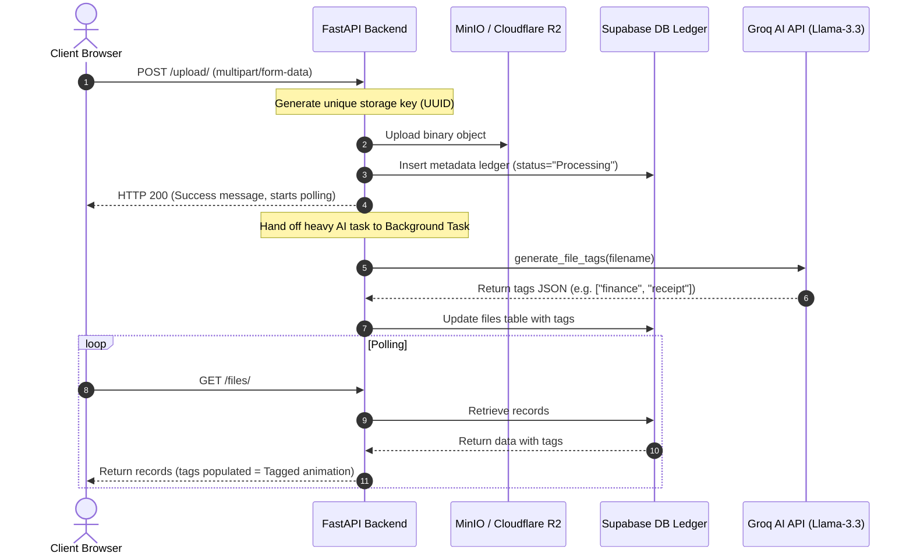

# BlackHole 🌌
### Autonomous AI-Powered Cloud Storage Engine

BlackHole (formerly OrbitSync Vault) is a cloud-native intelligent storage platform designed for zero-friction file organization, semantic search indexing, and real-time background sync. Built with a high-performance **FastAPI** backend, **Groq LLM (Llama 3.3)** semantic profiler, **Supabase** metadata ledger, **Cloudflare R2/MinIO** object storage, and a modern reactive **React/Vite** client compiled with the cutting-edge **Tailwind CSS v4** engine.

---

## 🛠️ Architecture & System Dataflow



### Core Architecture Components

1. **FastAPI Gateway Server**: Manages uploads, download tickets, expiring presigned sharing links, and tag queries.
2. **Groq AI Profiler**: Parses filenames asynchronously using the `llama-3.3-70b-versatile` model to extract semantic categorizations without reading raw contents, preserving privacy.
3. **Supabase Database**: Stores document schemas (id, filename, storage_key, tags list, creation timestamp).
4. **Cloudflare R2/MinIO Storage**: Stores binary blobs securely with randomly generated storage UUID keys, shielding actual assets from public endpoints.
5. **Vite React Frontend**: Modern dark-themed dashboard using TanStack Query for caching, Framer Motion for thinking scanner states, and standard progress tracking.
6. **Watchdog Daemon**: A python background service that monitors local directories for updates and pushes modifications directly to the server.

---

## 📂 Project Structure

```
OrbitSync-Backend/
├── app/                  # FastAPI Application Layer
│   ├── core/             # Configuration, S3 connections, Supabase client, AI Groq wrappers
│   ├── api.py            # Route Controllers (upload, download, share, search, list, delete)
│   └── main.py           # Application Entry & CORS configurations
├── daemon/               # Background Watchdog Services
│   └── sync_daemon.py    # Directory observer sync script
├── frontend/             # Single Page Application
│   ├── src/
│   │   ├── assets/       # Visual media and logo vectors
│   │   ├── components/   # Dashboard widgets (UploadZone, FileList, SearchBox, etc.)
│   │   ├── services/     # API Client using fetch & XHR progress
│   │   ├── store/        # React Context (Upload Queue, Polling & Activity log logs)
│   │   ├── types/        # TypeScript Interfaces
│   │   ├── App.tsx       # Routing & QueryClient initialization
│   │   └── main.tsx      # StrictMode launcher
│   ├── vite.config.ts    # Build config utilizing Tailwind CSS v4 compiler plugin
│   └── package.json      # Client package dependencies
├── requirements.txt      # Python library dependencies
└── Makefile              # Task Automation runner
```

---

## ⚡ API Endpoint Documentation

| Endpoint | Method | Security | Description |
| :--- | :--- | :--- | :--- |
| `/upload/` | `POST` | Public | Uploads file to S3/R2 and starts async AI tagging. |
| `/files/` | `GET` | Public | Lists all vault files metadata and tags. |
| `/files/{id}` | `DELETE` | Public | Deletes files from DB ledger and S3/R2 bucket storage. |
| `/download/{id}` | `GET` | Presigned (1 Hour) | Generates a 1-hour secure URL for direct asset retrieval. |
| `/share/{id}` | `GET` | Presigned (Dynamic) | Generates shared URL. Expiry minutes range: `1` to `10080` (7 Days). |
| `/search/` | `GET` | Public | Query search tags (case-insensitive database search). |

---

## ⚙️ Setting Up & Launching Locally

### 1. Environment Configuration

Create a `.env` file in the root directory containing the credentials:

```ini
# Storage Connections (Cloudflare R2 / MinIO)
AWS_ACCESS_KEY_ID=your_access_key
AWS_SECRET_ACCESS_KEY=your_secret_key
R2_BUCKET_NAME=your_bucket_name
S3_ENDPOINT_URL=https://your-account-id.r2.cloudflarestorage.com # or MinIO local URL

# Metadata Connection (Supabase)
SUPABASE_URL=https://your-supabase-project.supabase.co
SUPABASE_KEY=your_supabase_anon_or_service_role_key

# AI Semantic Profiler (Groq Cloud)
GROQ_API_KEY=gsk_your_groq_api_key
```

### 2. Launching the Backend API & Daemon

First, bootstrap the virtual environment and install backend requirements:
```bash
make bootstrap
```

Launch the FastAPI Server (starts on `http://127.0.0.1:8000`):
```bash
make run
```

Launch the Watchdog Sync Daemon (monitors `~/BlackHole_Sync` folder on your system):
```bash
make daemon
```

### 3. Launching the React Frontend

Open a new terminal window, navigate to the `frontend/` folder, install JavaScript dependencies, and run the Vite dev server:

```bash
cd frontend
npm install
npm run dev
```

The frontend client will boot on `http://localhost:5173`. Open this URL in a modern web browser to access the BlackHole interface.

---

## ⌨️ Desktop Shortcuts

To support zero-friction interaction, BlackHole exposes several global desktop keybindings:

* `Shift + K` : Revel the keyboard shortcuts help overlay.
* `Shift + U` : Trigger the native file browser selector dialog.
* `/` : Focus the semantic tag search input box.
* `ESC` : Dismiss open sharing or shortcut modals.

---

## 📈 Roadmap & Core Focus

- [x] Cloud Storage Upload integration with Cloudflare R2.
- [x] Asynchronous Groq AI tag generation.
- [x] Dynamic presigned link generations for secure sharing.
- [x] Watchdog sync daemon for local auto-uploads.
- [x] Tailwind CSS v4 React dashboard frontend.
- [x] Real-time upload queue and status polling.
- [ ] Multi-tenant secure user authentication.
- [ ] Fully-featured semantic vector search database indexer.
- [ ] Android and desktop native companion clients.

---

## 📄 License & Standards

Maintained by the BlackHole Open Source Engineering Group. Standardized under MIT license rules. Code review complies with industry security guidelines for cloud engineering projects.
